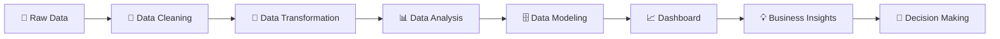

# 👋 Hi, I'm Shelly Garg

### 📊 Data Analyst | Power BI | SQL | Excel | Python | Tableau

Welcome to my GitHub profile! 🚀
I am passionate about transforming **raw data into meaningful insights, interactive dashboards, and business solutions**.

I enjoy working with data, discovering patterns, building dashboards, automating repetitive tasks, and creating data-driven solutions that help businesses make better decisions. 📈💡

---

## 🧑‍💻 About Me

* 🎓 **MCA Graduate** – Chandigarh University
* 📊 Aspiring **Data Analyst**
* 💻 Skilled in **Power BI, SQL, Excel, Python & Tableau**
* 📈 Interested in **Data Visualization & Business Intelligence**
* 🧹 Experienced with **Data Cleaning, Data Transformation & Data Analysis**
* 📊 Passionate about creating **interactive dashboards and reports**
* 🐍 Currently strengthening my **Python & AI skills**
* 🚀 Completed **50+ Data Analytics Projects**
* 🌐 Projects and work are available on my GitHub
* 📍 Based in **Gurgaon, India**
* 🔎 Open to **Data Analyst opportunities**

---

## 🛠️ Technical Skills

### 📊 Data Analytics & BI


### 🗄️ Database & Querying


### 🐍 Programming


### 🔄 Data Preparation

* Power Query
* ETL
* Data Cleaning
* Data Transformation
* Data Modeling
* Data Validation

### 📐 Analytics

* DAX
* Statistics
* KPI Analysis
* Business Analysis
* Exploratory Data Analysis
* Trend Analysis

### ⚙️ Automation

* Excel VBA
* Python Automation
* API Integration
* Automated Reporting

---

# 📈 What I Do

```text
Raw Data
    ↓
Data Cleaning
    ↓
Data Transformation
    ↓
Data Analysis
    ↓
Data Modeling
    ↓
Dashboard Development
    ↓
Business Insights
    ↓
Data-Driven Decisions 🚀
```

---

# 🚀 Featured Data Analytics Projects

## 🏨 1. Hotel Booking Cancellation Analysis

**Tools:** Python | Power BI | SQL | Excel | Power Query | DAX

📊 Analyzed hotel booking data to understand:

* Booking cancellations
* Revenue performance
* Occupancy trends
* Customer behavior
* Booking patterns
* Key business KPIs

🔍 Used Python, SQL and DAX for data cleaning, transformation, analysis and KPI development.

---

## 🛒 2. Amazon Sales & Vendor Performance Dashboard

**Tools:** Power BI | SQL | Excel | DAX | Power Query

📊 Developed an interactive dashboard to monitor:

* 💰 Sales
* 📈 Profit
* 📦 Inventory
* 🏪 Vendor performance
* 📊 Product KPIs
* 🎯 Business performance

Built automated reporting using **Power Query, SQL and DAX**.

---

## 🎵 3. Spotify Data Analysis

**Tools:** Excel | Power BI | Tableau | Python | SQL

Analyzed Spotify data to discover:

* 🎧 Popular songs
* 🎤 Artist performance
* 📈 Streaming trends
* ⭐ Track popularity
* 🎶 Music characteristics

Created interactive dashboards and visualizations to communicate insights effectively.

---

## 🎬 4. Netflix Data Analysis

**Tools:** Python | SQL | Excel | Power BI | Tableau

Analyzed Netflix content to identify:

* 🎬 Movies vs TV Shows
* 🌎 Country-wise content
* 📅 Content trends
* ⭐ Ratings
* 🎭 Genres
* 📊 Popular categories

---

## ❤️ 5. Heart Disease Analysis

**Tools:** Python | SQL | Power BI | Tableau | Excel

Performed exploratory and statistical analysis to understand:

* ❤️ Patient characteristics
* 📊 Risk factors
* 📈 Health-related patterns
* 🔍 Correlations
* 📉 Data trends

Built dashboards to present analytical findings visually.

---

## ✈️ 6. Airlines Data Analysis

**Tools:** Python | Power BI | Excel | SQL | Power Query | DAX

Analyzed airline-related data including:

* ✈️ Flight performance
* 👥 Customer information
* 📊 Operational KPIs
* 💰 Revenue
* 📈 Performance trends

---

## 🚚 7. Supply Chain Analytics

**Tools:** Python | SQL | Tableau

Analyzed supply-chain data to identify:

* 📦 Inventory trends
* 🚚 Delivery performance
* 💰 Cost analysis
* 📊 Supplier performance
* 📈 Operational insights

---

# 📊 Dashboard Gallery

### 💼 Power BI Dashboards

<p align="center">
  
  
</p>

### 📈 Tableau Dashboards

<p align="center">
  
  
</p>

### 📊 Excel Dashboards

<p align="center">
  
  
</p>

> 💡 Replace the image URLs above with your actual GitHub image links.

---

# 📚 Currently Learning

```text
🐍 Python for Data Analytics
🤖 Artificial Intelligence
📊 Advanced Power BI
📈 Advanced Tableau
🗄️ Advanced SQL
📐 Statistics
⚙️ Python Automation
🌐 API Integration
```

---

# 🧰 Tools & Technologies

| Category           | Technologies      |
| ------------------ | ----------------- |
| 📊 BI              | Power BI, Tableau |
| 📗 Spreadsheet     | Advanced Excel    |
| 🗄️ Database       | SQL               |
| 🐍 Programming     | Python            |
| 🔄 ETL             | Power Query       |
| 📐 Analytics       | Statistics, DAX   |
| ⚙️ Automation      | VBA, Python       |
| 🌐 Integration     | APIs              |
| 📝 Version Control | Git, GitHub       |

---

# 📊 My Data Analytics Workflow



---

# 🎯 Career Objective

> **"Turning data into insights, insights into strategies, and strategies into impact."** 📊💡🚀

I am looking for opportunities where I can use my skills in **Data Analytics, Business Intelligence, Data Visualization and Reporting** to solve real-world business problems.

---

# 🤝 Let's Connect

💼 **LinkedIn:** [Add your LinkedIn URL]

🌐 **Portfolio:** [Add your Portfolio URL]

🐙 **GitHub:** [Add your GitHub URL]

📧 **Email:** [Add your professional email]

---

# 💬 Open to Opportunities

🚀 **Data Analyst**
📊 **Power BI Developer**
📈 **BI Analyst**
🗄️ **SQL Analyst**
📊 **MIS / Reporting Analyst**

If you have a suitable opportunity, project, collaboration, or freelance requirement, feel free to connect with me. 🤝

---

## ⭐ Support My Work

If you find my projects useful:

⭐ Star my repositories
🍴 Fork the projects
💬 Share your feedback
🤝 Connect with me

Your support motivates me to keep learning, building and sharing! ❤️

---

# 👩‍💻 Author

### **Shelly Garg**

**Data Analyst | Power BI | SQL | Excel | Python | Tableau**

📊 *Turning Data Into Insights* 🚀

---

<p align="center">

### ⭐ Thanks for visiting my GitHub profile! ⭐

**Made with ❤️ by Shelly Garg**

</p>
